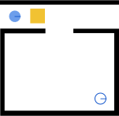

Guides
=============

How to Create a Scenario
------------------------

Each Namosim scenario is fully contained in a single SVG file.

The Geometry File
~~~~~~~~~~~~~~~~~
Here are the contents of a minimal svg geometry file. All geometries in the world must be svg **path**
elements and each must have an **id** attribute which is used by the **<namo_config>** to configure the geometry
as an entity in the simulation.

.. literalinclude:: ../../tests/unit/scenarios/minimal_stilman_2005.svg
  :language: xml

Here is the same file rendered as an image:

You can see the robot starting position in the top left. To the right of the robot is a movable box. The walls
are in black. The robot goal pose is visible in the bottom right.

We recommend using `Inkscape <https://inkscape.org/>`_ to edit your svg geometry file.

The Namo Config
~~~~~~~~~~~~~~~~~
The scenario file must contain a `<namo_config>` element that is a direct child of the root `<svg>` element.
This object configures the simulator and agents and it the place where all agent behavioral parameters are set.

The full specification for the `<namo_config>` is defined by the `NamosimConfigModel` class which can be found in 
`namosim/data_models.py <https://gitlab.inria.fr/chroma/namo/namosim/-/blob/dev/namosim/data_models.py?ref_type=heads>`_.

Robots and Navigation Goals
~~~~~~~~~~~~~~~~~~~~~~~~~~~
Robot and goal geometries are expected to be ``<svg:g>`` elements. Each must have two ``<svg:path>`` children:
1 for the shape of the entity and one for the orientation. Below is an example goal.

.. code-block:: xml

  <svg:g id="goal_0">
    <svg:path
        d="m 121.17572,125.39975 0,0 c 0,-3.87867 3.14428,-7.02295 7.02295,-7.02295 l 0,0 c 1.8626,0 3.64891,0.73992 4.96597,2.05698 1.31706,1.31705 2.05697,3.10337 2.05697,4.96597 l 0,0 c 0,3.87866 -3.14428,7.02294 -7.02294,7.02294 l 0,0 c -3.87867,0 -7.02295,-3.14428 -7.02295,-7.02294 z"
        id="goal_01" type="shape"
        style="fill:none;fill-rule:evenodd;stroke:#1155cc;stroke-linecap:square;stroke-miterlimit:10;stroke-opacity:1"
        inkscape:connector-curvature="0" inkscape:label="#path29-7" />
    <svg:path
        style="fill:none;stroke:#1155cc;stroke-width:0.91469419px;stroke-linecap:butt;stroke-linejoin:miter;stroke-miterlimit:10;stroke-opacity:1"
        d="m 128.68048,125.58529 6.88078,0" id="orientation" inkscape:connector-curvature="0" sodipodi:nodetypes="cc"
        inkscape:label="#path4217" />
  </svg:g>

The shape path must have the attribute ``type="shape"`` and the orientation path must have an attribute ``type="orientation"``. This 
is true for both robots and goals.

When creating a new scenario, we recommend copying and modifying an existing scenario whenever possible.