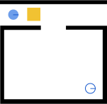

Guides
=============

How to Create a Scenario
------------------------

Each Namosim scenario is composed of three files:

1. **A geometry file**: an svg image containing the world geometry
2. **A world config**: json file containing metadata about the sorld
3. **A simulation config**: json file containing metadata about the simulation

The Geometry File
~~~~~~~~~~~~~~~~~
Here are the contents of a minimal svg geometry file. All geometries in the world must be svg **path**
elements and each must have an **id** attribute which is used by the **world config** to configure the geometry
as an entity in the world.

.. literalinclude:: ../../tests/unit/data/scenarios/minimal.svg
  :language: xml

Here is the same file rendered as an image:

You can see the robot starting position in the top left. To the right of the robot is a movable box. The walls
are in black. The robot goal pose is visible in the bottom right.

We recommend using `Inkscape <https://inkscape.org/>`_ to edit your svg geometry file.

The World Config
~~~~~~~~~~~~~~~~~
Here are the contents of a minimal world config which configures the world based on the geometry file above.

.. literalinclude:: ../../tests/unit/data/scenarios/minimal_world.json
  :language: json

The full specification for the world config is defined by the `WorldModel` class which can be found in 
`namosim/world/models.py <https://gitlab.inria.fr/chroma/namo/namosim/-/blob/dev/namosim/world/models.py?ref_type=heads>`_.

The Simulation Config
~~~~~~~~~~~~~~~~~~~~~
Here are the contents a simulation config which corresponds to the same two scenario files above.

.. literalinclude:: ../../tests/unit/data/scenarios/minimal_sim.json
  :language: json

The full specification for the world config is defined by the `SimulationModel` class which can be found in 
`namosim/models.py <https://gitlab.inria.fr/chroma/namo/namosim/-/blob/dev/namosim/models.py?ref_type=heads>`_.