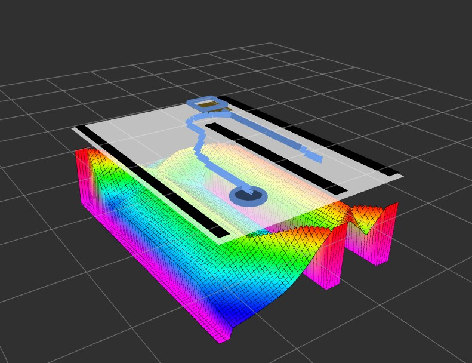

Introduction
============

Overview
***********

NAMOSIM is a simulator designed for research on problem of **N**\ avigation **A**\ mong **M**\ ovable **O**\ bstacles (NAMO).

NAMOSIM is a research focused simulator that simulates robots navigating in 2D polygonal environment in which certain
obstacles may be manipulated (moved). This problem is pertinent for real-world robotics applications such as indoor, social environments
where robots may need to move or manipulate objects in order to navigate and complete their tasks.

Cite Us
***********
If you use NAMO in any capacity for your research, please do cite the associated paper:
::
  @inproceedings{renault:hal-02912925,
    TITLE = {{Modeling a Social Placement Cost to Extend Navigation Among Movable Obstacles (NAMO) Algorithms}},
    AUTHOR = {Renault, Benoit and Saraydaryan, Jacques and Simonin, Olivier},
    URL = {https://hal.archives-ouvertes.fr/hal-02912925},
    BOOKTITLE = {{IROS 2020 - IEEE/RSJ International Conference on Intelligent Robots and Systems}},
    ADDRESS = {Las Vegas, United States},
    SERIES = {2020 IEEE/RSJ International Conference on Intelligent Robots and Systems (IROS) Conference Proceedings},
    PAGES = {11345-11351},
    YEAR = {2020},
    MONTH = Oct,
    DOI = {10.1109/IROS45743.2020.9340892},
    KEYWORDS = {Navigation Among Movable Obstacles (NAMO) ; Socially- Aware Navigation (SAN) ; Path planning ; Simulation},
    PDF = {https://hal.archives-ouvertes.fr/hal-02912925/file/IROS_2020_Camera_Ready.pdf},
    HAL_ID = {hal-02912925},
    HAL_VERSION = {v1},
  }
