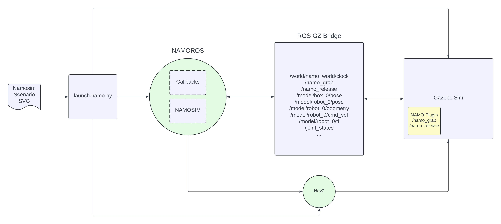
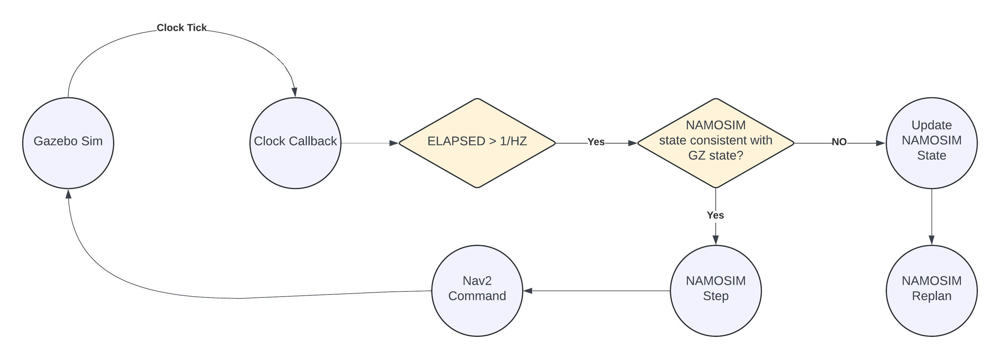

# namoros

## System Requirements

- Python >=3.10,<3.13
- ROS2 Humble
- Gazebo Fortress

You may also need to install the following ros packages

```
sudo apt update && sudo apt install ros-humble-rosgraph-msgs ros-humble-grid-map
```

## Usage

First, install the dependencies:

```
pip install -r requirements.txt
```

Then you will need to convert a namo_planner svg scenario file into an Gazebo SDF + config files for nav2. To do this run

```
python3 -m namoros.scripts.scenario2sdf --svg-file config/1_robot_2_obstacles.svg --out-dir config
```

## Compile the GZ plugins

### GZ

```
mkdir -p gz_plugin/build
cd gz_plugin/build && cmake .. && make && cd ../..
```

### Build
Build the namoros package

```
colcon build
```

### Run Simulation

```
./launch.sh
```

## Usage on a Real Robot

The first step to run on a real robot is to prepare the map image and yaml files and the namo-config yaml file.

## Note

The units of all namo_planner svg scenario files must be in centimeters!

## High-Level Architecture



## High-Level Internal Operation


