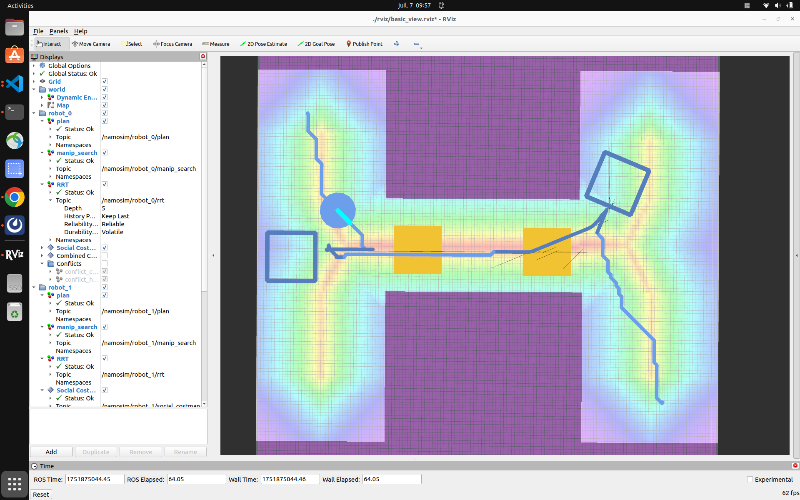

# Summary

**NAMOSIM** is a mobile robot motion planner designed for the problem of **N**avigation **A**mong **M**ovable **O**bstacles (NAMO). The planner simulates robots navigating in 2D polygonal environments where certain obstacles can be grasped and relocated to enable robots to reach their goals. NAMOSIM extends the classic navigation problem with a layer of interactivity, posing interesting research questions while remaining well-defined and amenable to both classical and learning-based approaches. NAMOSIM supports multi-robot environments and provides a baseline NAMO algorithm along with a communication-free coordination strategy. The simulator includes support for holonomic and differential-drive motion models and integrates with ROS2 for visualization in RViz.

NAMOSIM uses a modular agent-based architecture and includes a baseline NAMO algorithm [@stilman_2005] implemented in the `Stilman2005` agent, which also incorporates a communication-free coordination strategy for multi-robot scenarios. A variety of other agent types are implemented, and new agents utilizing alternative approaches can be created and integrated into the planner by implementing the **Agent** base class. Thus, new navigation algorithms, including those based on machine learning or AI, can be developed within NAMOSIM, facilitating reproducible research on NAMO problems.

NAMOSIM utilizes ROS2 messages for visualization of environments and plans using RViz and includes several prebuilt scenarios for testing and benchmarking. Scenarios are stored as SVG files, allowing custom scenarios to be created using a free SVG editor such as Inkscape.

NAMOSIM is packaged as a ROS2 package for easy integration into robotics projects but can also be used as a standalone Python module. The package is intended for researchers and developers working on robot navigation in dynamic environments, particularly where physical interaction is necessary.

# Statement of Need

Many applications in autonomous mobile robotics involve physical interaction with the environment and social coordination with other agents. However, standard navigation planners assume static, non-interactive environments, limiting their applicability in complex real-world scenarios. NAMO problems involve not only path planning but also reasoning about which obstacles to move, where to move them, and how to combine standard navigation with obstacle manipulation. NAMOSIM addresses this gap by offering a simulation environment explicitly designed to study and prototype NAMO algorithms. Additionally, NAMOSIM supports multi-robot environments, facilitating reproducible research in multi-robot navigation among movable obstacles (MR-NAMO).

# Major Features

NAMOSIM provides a robust set of features to support research and development in Navigation Among Movable Obstacles (NAMO):

- **Modular Agent-Based Architecture**: The simulator is built around a flexible `Agent` interface, allowing users to implement and test custom NAMO planning algorithms. A baseline implementation of the `Stilman2005` planner is included for immediate use and benchmarking.
- **Support for Multiple Robot Models**: NAMOSIM supports both holonomic and differential-drive robot models, enabling realistic simulation of various robotic platforms.
- **ROS2 Integration**: NAMOSIM forms a ROS2 package, enabling seamless integration into simulated and physical robotics projects and visualization via RViz.
- **2D Environment Simulation**: The simulator provides a customizable 2D environment where users can define static and movable obstacles, supporting complex scenarios for testing multi-robot coordination strategies and NAMO algorithms.
- **Prebuit Scenarios and Tests**: NAMOSIM includes several custom scenario files for benchmarking and testing of specific situations.
- **Multi-Robot Coordination**: The simulator supports multi-robot scenarios, and our baseline agent `Stillman2005` agent` implements the communication-free coordination strategy presented in our IROS-2024 publication[@renault_2024_iros].

These features make NAMOSIM a versatile tool for prototyping, evaluating, and deploying NAMO algorithms in diverse robotic applications.

# Customizable Scenarios

NAMOSIM environments, or **scenarios**, are stored in SVG format and can be edited using any SVG editor, such as Inkscape. The scenario SVG file contains the following key elements:

- The geometry of the static map
- The polygons and orientations of all robots and movable obstacles
- Configuration settings that define the behavior of the environment and robots

The static map can also be included as an image layer within the SVG to conveniently incorporate ROS grid-map images generated by standard mapping tools.

# Architecture

At a high level, NAMOSIM executes a SENSE-THINK-ACT loop that performs the following functions at each iteration:

1. **SENSE**: Each agent senses the environment and updates its internal representation.
2. **THINK**: Each agent computes a new plan or updates its current plan.
3. **ACT**: Each agent selects a single discrete action to execute.

The loop is expected to execute at a regular frequency, with the assumption that all agent functions run sequentially in a synchronized manner.

## Stilman's Algorithm

NAMOSIM includes a baseline implementation of Stilman's 2005 NAMO algorithm [@stilman_2005]. The key idea of this algorithm is to move obstacles to merge disjoint components of the robot's free configuration space. The map is divided into a set of disjoint **connected components**, where each cell in a given component is reachable from all other cells in the same component. It can be proven that components are separated by movable obstacles or are otherwise unreachable. The algorithm functions by moving obstacles to join components until the robot's current component includes the goal cell.

The algorithm works by recursively performing the following two stages:

1. **SELECT_OBSTACLE_AND_COMPONENT**: The first stage performs a simplified A\* grid search, allowing the agent to pass through movable obstacles. It returns the ID of the first movable obstacle encountered on the optimal path to the goal and the ID of the component encountered after passing through the obstacle.
2. **OBSTACLE_MANIPULATION_SEARCH**: The second stage finds a **transit path** from the robot's current position to a grasp pose near the obstacle. Then, it finds a **transfer path** by performing an obstacle manipulation search to join the robot's current component to the component selected in stage 1. If this stage fails, the obstacle and component pair are added to an avoid-list, and the algorithm returns to stage 1.

Each iteration of the algorithm continues with a copy of the environment where the robot and obstacle start from the poses resulting from the previous obstacle manipulation search. This algorithm is explained in greater detail in Renault's 2023 PhD thesis [@renault_phd_thesis].

## Collision Detection

Custom agents can implement their own collision detection routines; however, the baseline `Stilman2005` agent detects collisions using a simple binary-occupancy grid during transit paths (when not carrying an obstacle), assuming a circular robot footprint. When transporting a movable obstacle, the robot footprint is non-circular, and collision detection is based on the **convex swept volume** resulting from the area swept by the combined robot-obstacle footprint due to the action motion. Although computationally expensive, this ensures all possible collisions are detected, regardless of the shape of the robot or obstacle.

## Social Costmap

A novel contribution in the baseline implementation is the option to use a social costmap during the obstacle manipulation search to guide obstacle placement decisions. This allows robots to place obstacles in areas less likely to block the free passage of other agents, including humans, reducing the likelihood that obstacles will need to be moved again. The key heuristic of the social costmap is to **avoid narrow corridors and central areas**, assigning higher costs to narrow corridors and the centers of open spaces. This helps robots avoid placing obstacles in front of doorways or in the center of rooms. The social costmap is explained in greater detail in [@renault_2020_iros, @renault_2024_iros, @renault_phd_thesis].

## Conflict Avoidance and Deadlock Resolution

The baseline `Stilman2005` agent can avoid conflicts and resolve deadlocks with other agents. Conflict avoidance works by looking ahead along the agent's current plan for a fixed number of steps, called the **conflict horizon**. Within this horizon, the agent simulates each planned action and checks for potential conflicts, such as an obstacle moved by another robot or a collision with another robot crossing the planned path.

The `Stilman2005` agent avoids conflicts by either pausing or replanning around them. A deadlock is detected when a conflict configuration is repeatedly encountered, even after replanning. To resolve deadlocks, the agent follows an evasion strategy as described in [@renault_2024_iros].

# Acknowledgements

This research was supported by an Inria ADT initiative. We express our gratitude to Benoit Renault, whose PhD thesis forms the foundation of this work.

# References
